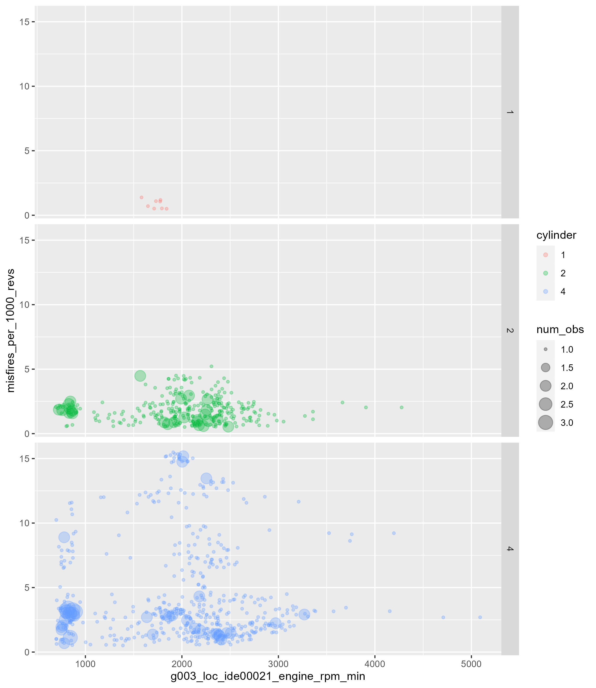

# `misfires_rpm.R`

This reads in data logged by the VCDS and produces a jittered bubble plot of misfires per 1000 revs vs. rpm

---

## Scan tool instructions

If you don't want to modify code, log data from the following channels:

* Engine RPM
* Vehicle speed
* Misfire totalizer
* Misfires per 1000 revolutions of cylinder 1
* Misfires per 1000 revolutions of cylinder 2
* Misfires per 1000 revolutions of cylinder 3
* Misfires per 1000 revolutions of cylinder 4
* Numb.of misfir.: cylinder 1
* Numb.of misfir.: cylinder 2
* Numb.of misfir.: cylinder 3
* Numb.of misfir.: cylinder 4
* Misfires all cylinders per 1000 rpm

---

## Running Script

1. open `misfires_rpm.R` script in R Studio

2. `alt-o` to collapse code

3. change variable values in `"USER DEFINED VARIABLES"`

4. run script `ctrl-a` then `ctrl-enter` or `ctrl-return`

## Output

plot will be save into `output`

